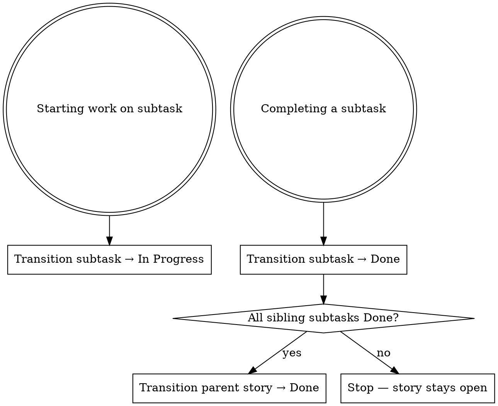

# Jira Subtask Lifecycle

## Overview
Keep Jira subtask and parent story statuses in sync with actual development progress. Never close a story until all its subtasks are Done.

## Workflow



## Step-by-Step

### When starting a subtask
1. Fetch available transitions: `getTransitionsForJiraIssue(issueId: <subtaskId>)`
2. Find the "In Progress" transition ID from the response
3. Apply it: `transitionJiraIssue(issueId: <subtaskId>, transitionId: <id>)`

### When completing a subtask
1. Fetch available transitions: `getTransitionsForJiraIssue(issueId: <subtaskId>)`
2. Find the "Done" transition ID
3. Apply it: `transitionJiraIssue(issueId: <subtaskId>, transitionId: <id>)`
4. Fetch the parent story: `getJiraIssue(issueId: <parentStoryId>)`
5. Check all subtasks in the `subtasks` field — if every subtask has `status.name === "Done"`, transition the parent story to Done

### Checking the parent story
```
parent = getJiraIssue(parentStoryId)
allDone = parent.fields.subtasks.every(s => s.fields.status.name === "Done")
if (allDone) → transitionJiraIssue(parentStoryId, doneTransitionId)
```

## Rules

- **Always call `getTransitionsForJiraIssue` first** — transition IDs differ per project board, never hardcode them
- **Never close the parent story** if any subtask is still In Progress or To Do
- **Always transition subtask to In Progress** when you start working on it, not just when you finish

## Common Mistakes

| Mistake | Fix |
|--------|-----|
| Closing parent story before checking subtasks | Always fetch parent and verify all subtasks are Done first |
| Hardcoding transition IDs | Always look up with `getTransitionsForJiraIssue` |
| Forgetting to move subtask to In Progress | Transition at the start of work, not just at the end |
| Transitioning parent manually without subtask check | Follow the workflow — subtask Done triggers the parent check |
